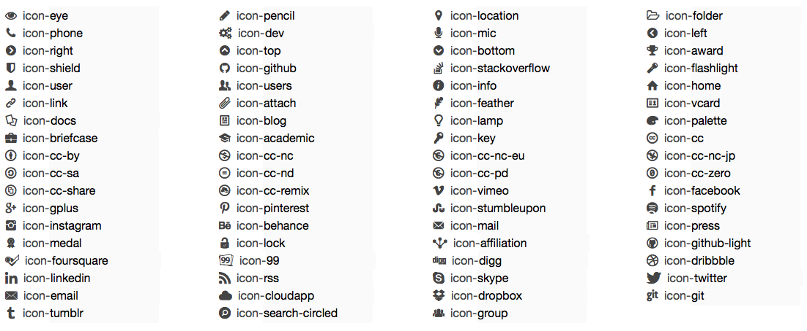

RedLight
========

RedLight is a responsive theme using HTML5, CSS3, JS.

**Current version:** 0.2 (2013-10-26)

###### LICENCE

This theme is freely available under <a href="http://creativecommons.org/licenses/by-nc-sa/3.0/" target="_blank">Creative Commons BY-NC-SA Licence</a>.

JQuery and icons might have different licences, check them.

If you add some options, feel free to pull request to the RedLight main repo! (please do so!)

***

## Help

#### Installation

*Please, add your website to the list at the end of this file.*

###### GITHUB PAGES

Fork this repository, rename it to "*your-username*.github.io" (or like you want).

If you have a personal domain, add a <a href="https://help.github.com/articles/setting-up-a-custom-domain-with-pages" target="_blank">CNAME file</a>.

###### SELF-HOSTED

You can <a href="https://github.com/f-mb/redlight/archive/master.zip">download RedLight</a>.

###### FILE ARCHITECTURE

Do not change file architecture:

	|	index.html
	|	customize.css (optional)
	|	picture.jpg (optional)
	|	redlight/
	|		redlight.css
	|		redlight.js
	|		icons/
	|			...
	|	template-index.html
	|	template-customize.css

#### Create Page

Create a "index.html" file (use code in "tpl-index.html").

You can subdivise sections using h2, h3 and h4 headings. 

For new menus, sections or social links, the following icons are included in RedLight:

#### Customize Layout

By default, RedLight use a grey-based layout; but you can customize it.

To do so, create a "customize.css" file (use code in "tpl-customize.css"; uncomment parts you want to customize; do not delete "!important" mentions!).

No other action needed. The "customize.css" will be automatically load by RedLight.

*Recommandation:* Use only one different color, called "On Color" in "tpl-customize.css".

***

## Websites using RedLight

http://f-mb.org
